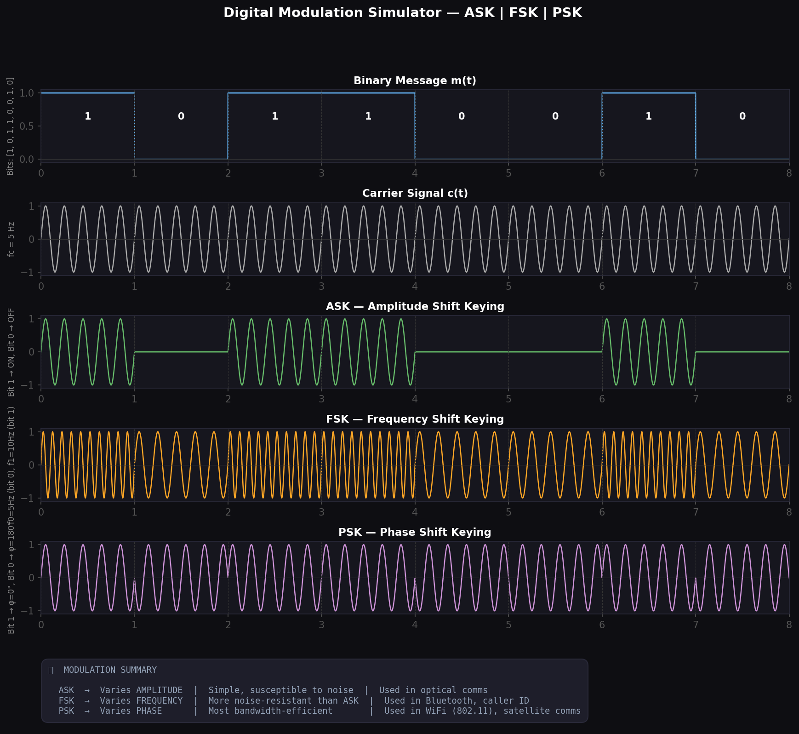
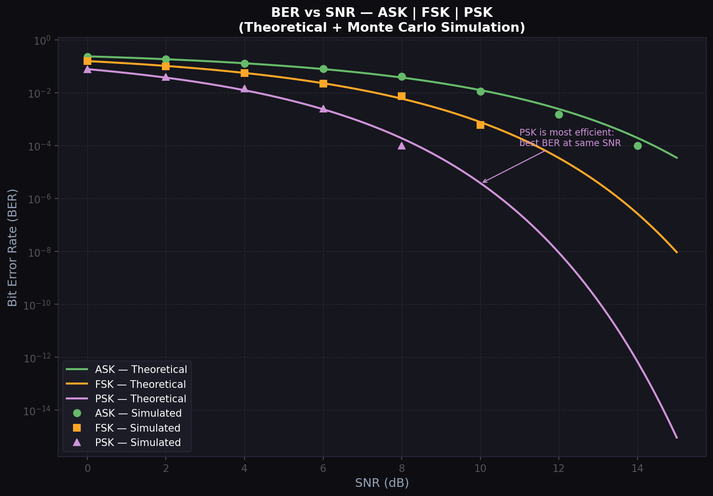

# 📡 Digital Modulation Simulator — ASK | FSK | PSK

A Python-based simulator that visualises the three fundamental digital modulation techniques used in modern communication systems — built from the ground up using core signal processing math.

---

## 📸 Demo




---

## ✨ What it does

| Module | Description |
|---|---|
| `modulation_simulator.py` | Generates and plots ASK, FSK, PSK signals from a binary input |
| `ber_analysis.py` | Plots BER vs SNR curves — theoretical formulas + Monte Carlo simulation |
| `nlp_error_correction.py` | Simulates text transmission over a noisy channel and uses NLP to fix bit errors |

---

## 🧠 The Math

### ASK — Amplitude Shift Keying
```
s(t) = m(t) × A × sin(2πfct)
where m(t) ∈ {0, 1}
```
Bit 1 → carrier ON. Bit 0 → carrier OFF.

### FSK — Frequency Shift Keying
```
s(t) = A × sin(2πf₁t)   when bit = 1
s(t) = A × sin(2πf₀t)   when bit = 0
```
Carrier frequency switches between f₀ and f₁.

### PSK — Phase Shift Keying (BPSK)
```
s(t) = A × sin(2πfct + φ(t))
where φ(t) ∈ {0, π}
```
Bit 1 → phase 0°. Bit 0 → phase 180°.

### BER Formulas (from Haykin)
```
ASK:  Pe = 0.5 × erfc(√(SNR/4))
FSK:  Pe = 0.5 × erfc(√(SNR/2))
PSK:  Pe = 0.5 × erfc(√SNR)      ← most efficient
```

---

## 🚀 How to Run

```bash
git clone https://github.com/Vibha-13/modulation-simulator
cd modulation-simulator

pip install -r requirements.txt

# Run modulation visualiser
python3 src/modulation_simulator.py

# Run BER vs SNR analysis
python3 src/ber_analysis.py

# Run NLP Smart Error Correction demo
python3 src/nlp_error_correction.py
```

---

## 🏗 Architecture

```
Binary Input
     │
     ├──→ ASK: multiply bit signal × carrier
     ├──→ FSK: switch carrier frequency per bit
     └──→ PSK: shift carrier phase by π for bit 0
                    │
                    ↓
            Matplotlib plots
            Signal metrics (power, peak)
            BER vs SNR (theoretical + simulated)
```

---

## 🛠 Tech Stack

- **Python** — core logic
- **NumPy** — signal generation, math
- **Matplotlib** — visualisation
- **SciPy** — `erfc()` for theoretical BER curves

---

## 🔮 Future Improvements

- [ ] Add QAM (Quadrature Amplitude Modulation)
- [ ] Interactive Streamlit UI — change bits and frequency live
- [ ] Constellation diagram (I-Q plot) for PSK/QAM
- [ ] OFDM simulation (used in 4G/5G, WiFi)

### 🤖 Machine Learning & NLP Extensions
- **Semantic Communication (6G)**: Encode text into dense vector embeddings using NLP models (like Autoencoders/Transformers), transmit them over the AWGN channel using PSK/FSK, and decode at the receiver to reconstruct *meaning* rather than exact bits.
- ✅ **NLP-Powered Smart Error Correction (Implemented!)**: Modulates ASCII text over a high-noise channel, resulting in garbled text. Uses a spellchecker/NLP logic to automatically correct errors using language context. (See `src/nlp_error_correction.py`)
- **AI Modulation Recognition**: Generate thousands of short noisy signal bursts and train a sequence model (LSTM or 1D-Transformer) to automatically classify the modulation scheme (ASK/FSK/PSK) from the raw waveform data.

---
## 🎯 Why This Project Stands Out

- Built from first principles — no communication libraries used
- Implements modulation techniques taught in ECE coursework
- Includes both:
  - Signal-level visualization
  - System-level performance analysis (BER vs SNR)
- Bridges theory (Haykin) with practical simulation

> This project demonstrates how communication systems behave under noise — a core concept in real-world RF and satellite systems.

## 👩‍💻 Author

**Vibha** · ECE @ NMIT Bengaluru  
[LinkedIn](https://linkedin.com/in/yourprofile) · [GitHub](https://github.com/Vibha-13)

> *Built from Communication Systems coursework — implementing theory in code.*